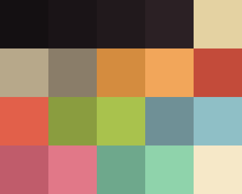

# MonoLisa Theme

 

<i><b>MonoLisa</b> is a warm, low-contrast dark theme engineered for extended programming sessions.  
It prioritizes visual stability, reduces eye strain, and provides a consistent semantic color system across terminal, editor, and UI surfaces.</i>

---

## Overview

Unlike conventional dark themes built on cool grays and high contrast, MonoLisa uses a subtly warm, red-shifted foundation with carefully controlled saturation.  
This creates a calmer visual environment that remains readable over long periods without introducing fatigue.

Rather than maximizing contrast, the theme focuses on **perceptual balance** — preserving hierarchy and clarity without overwhelming the eye.

## Design Principles

The palette is structured around a small set of disciplined rules:

- **Soft foreground tones**  
  Optimized for long-form readability without glare or excessive brightness.

- **Layered, muted backgrounds**  
  Provide depth and hierarchy without visual distraction.

- **Controlled semantic accents**  
  Colors are assigned consistently to meaning (syntax, state, feedback), avoiding randomness and visual noise.

## Palette

<b>MonaLisa (Dark)</b>

 
<table>
  <tr>
    <th>Label</th>
    <th>Hex</th>
    <th>RGB</th>
    <th>HSL</th>
    <th>Description</th>
  </tr>
  <tr>
    <td>Background</td>
    <td><code>#14110F</code></td>
    <td><code>rgb(20, 17, 15)</code></td>
    <td><code>hsl(24, 14%, 7%)</code></td>
    <td>Main background; deep umber tone with warm undertone.</td>
  </tr>
  <tr>
    <td>Background Alt</td>
    <td><code>#1B1613</code></td>
    <td><code>rgb(27, 22, 19)</code></td>
    <td><code>hsl(22, 17%, 9%)</code></td>
    <td>Secondary background for panels and containers.</td>
  </tr>
  <tr>
    <td>Surface</td>
    <td><code>#231C18</code></td>
    <td><code>rgb(35, 28, 24)</code></td>
    <td><code>hsl(22, 19%, 12%)</code></td>
    <td>Interactive surfaces: active line, inputs.</td>
  </tr>
  <tr>
    <td>Surface High</td>
    <td><code>#2C231E</code></td>
    <td><code>rgb(44, 35, 30)</code></td>
    <td><code>hsl(21, 19%, 15%)</code></td>
    <td>Elevated elements: hover states, popups.</td>
  </tr>
  <tr>
    <td>Foreground</td>
    <td><code>#E8DCC0</code></td>
    <td><code>rgb(232, 220, 192)</code></td>
    <td><code>hsl(42, 42%, 83%)</code></td>
    <td>Primary text; parchment-like tone.</td>
  </tr>
  <tr>
    <td>Foreground Dim</td>
    <td><code>#B8AA94</code></td>
    <td><code>rgb(184, 170, 148)</code></td>
    <td><code>hsl(37, 21%, 65%)</code></td>
    <td>Secondary text and UI labels.</td>
  </tr>
  <tr>
    <td>Foreground Faint</td>
    <td><code>#7E7466</code></td>
    <td><code>rgb(126, 116, 102)</code></td>
    <td><code>hsl(35, 11%, 45%)</code></td>
    <td>Comments, hints, inactive text.</td>
  </tr>
  <tr>
    <td>Teal</td>
    <td><code>#6F8F88</code></td>
    <td><code>rgb(111, 143, 136)</code></td>
    <td><code>hsl(167, 13%, 50%)</code></td>
    <td>Secondary accent for UI highlights.</td>
  </tr>
  <tr>
    <td>Teal Bright</td>
    <td><code>#8FB3AA</code></td>
    <td><code>rgb(143, 179, 170)</code></td>
    <td><code>hsl(165, 20%, 63%)</code></td>
    <td>Hover states and emphasis.</td>
  </tr>
  <tr>
    <td>Muted Cyan</td>
    <td><code>#6E7F87</code></td>
    <td><code>rgb(110, 127, 135)</code></td>
    <td><code>hsl(199, 10%, 48%)</code></td>
    <td>Functions, links, structure.</td>
  </tr>
  <tr>
    <td>Muted Cyan Bright</td>
    <td><code>#8FA3AD</code></td>
    <td><code>rgb(143, 163, 173)</code></td>
    <td><code>hsl(200, 15%, 62%)</code></td>
    <td>Active structural highlights.</td>
  </tr>
  <tr>
    <td>Olive</td>
    <td><code>#7A8B5A</code></td>
    <td><code>rgb(122, 139, 90)</code></td>
    <td><code>hsl(81, 21%, 45%)</code></td>
    <td>Strings and success states.</td>
  </tr>
  <tr>
    <td>Olive Bright</td>
    <td><code>#93A86A</code></td>
    <td><code>rgb(147, 168, 106)</code></td>
    <td><code>hsl(80, 27%, 54%)</code></td>
    <td>Highlighted data values.</td>
  </tr>
  <tr>
    <td>Amber</td>
    <td><code>#C69A5B</code></td>
    <td><code>rgb(198, 154, 91)</code></td>
    <td><code>hsl(35, 48%, 57%)</code></td>
    <td>Warnings, numbers, constants.</td>
  </tr>
  <tr>
    <td>Amber Bright</td>
    <td><code>#E0B97A</code></td>
    <td><code>rgb(224, 185, 122)</code></td>
    <td><code>hsl(37, 61%, 68%)</code></td>
    <td>Emphasized values.</td>
  </tr>
  <tr>
    <td>Rose</td>
    <td><code>#8C5A6B</code></td>
    <td><code>rgb(140, 90, 107)</code></td>
    <td><code>hsl(340, 22%, 45%)</code></td>
    <td>Keywords and control flow.</td>
  </tr>
  <tr>
    <td>Rose Bright</td>
    <td><code>#A87486</code></td>
    <td><code>rgb(168, 116, 134)</code></td>
    <td><code>hsl(339, 24%, 56%)</code></td>
    <td>Enhanced syntax highlighting.</td>
  </tr>
  <tr>
    <td>Red</td>
    <td><code>#A14F3F</code></td>
    <td><code>rgb(161, 79, 63)</code></td>
    <td><code>hsl(10, 44%, 44%)</code></td>
    <td>Error states and failures.</td>
  </tr>
  <tr>
    <td>Red Bright</td>
    <td><code>#C26152</code></td>
    <td><code>rgb(194, 97, 82)</code></td>
    <td><code>hsl(8, 47%, 54%)</code></td>
    <td>Critical alerts and emphasis.</td>
  </tr>
</table>

